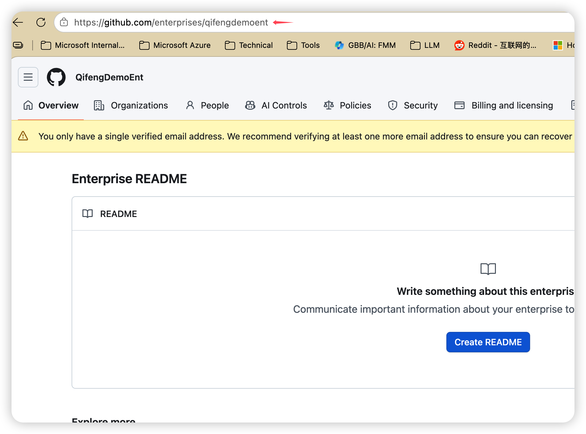

# GitHub Copilot 放行域名清单（汇总）

来源页面：
- https://docs.github.com/en/enterprise-cloud@latest/copilot/reference/copilot-allowlist-reference

更新时间：2026-03-04

> 说明
> - 以下为官方页面汇总结果，按分类整理。
> - 页面以 HTTPS URL 为主，网络策略通常对应 TCP 443。
> - 带 `*` 的为通配匹配。

---

## 1) GitHub Copilot 核心必需（GitHub public URLs）

- `https://github.com/login/*`
- `https://github.com/enterprises/YOUR-ENTERPRISE/*`（仅 Enterprise Managed Users 场景）
- `https://api.github.com/user`
- `https://api.github.com/copilot_internal/*`
- `https://copilot-telemetry.githubusercontent.com/telemetry`
- `https://collector.github.com/*`
- `https://default.exp-tas.com`
- `https://copilot-proxy.githubusercontent.com`
- `https://origin-tracker.githubusercontent.com`
- `https://*.business.githubcopilot.com`
- `https://*.enterprise.githubcopilot.com`
- `https://copilot-reports-*.b01.azurefd.net`（Copilot 使用报表下载）

---
YOUR-ENTERPRISE 需要替换为实际的企业名称，可以在 GitHub Enterprise 的 URL 中找到。

## 2) 如果需要限制个人账户登陆Github.com，需要限制以下域名，严格按照下面的URL做限制：

-  `https://github.com/`

## 3) 建议执行策略（落地）

1. **先最小放行核心域名**：先放行“第 1 节 GitHub public URLs”。
2. **变更可审计**：将放行规则按分类分组并保留变更记录。
3. **定期回看官方文档**：GitHub 会更新域名列表，建议按季度复核。
